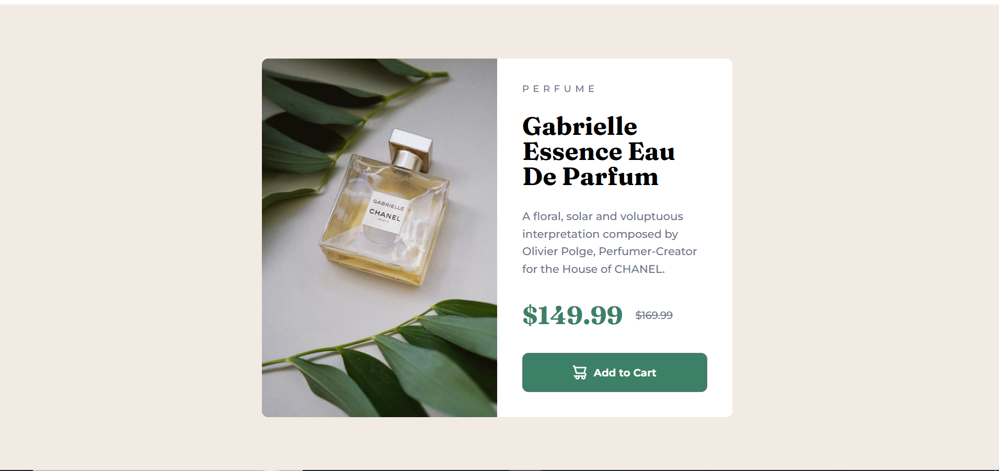

# Product Preview Card Component

A responsive product preview card built as part of a [Frontend Mentor](https://www.frontendmentor.io/) challenge.

The goal was to recreate the provided design as accurately as possible while making the component work across desktop and mobile screen sizes.

## Preview



## What I Built

The component includes:

- A two-column desktop layout
- A stacked mobile layout
- Different product images for desktop and mobile
- Product information and pricing
- A responsive Add to Cart button
- Hover styling for the button
- Responsive typography and spacing

## Technologies

- HTML5
- CSS3
- CSS Grid
- Flexbox
- Media Queries
- `<picture>` for responsive images
- Google Fonts

## A Few Things I Learned

### Responsive images

I used the `<picture>` element to provide different images depending on the screen size.

This allowed the desktop and mobile designs to use their intended product images instead of trying to force one image to work for both layouts.

### Grid and Flexbox

I used CSS Grid for the desktop version because the design consists of two equal sections.

For the mobile version, I changed the layout to Flexbox and stacked the image and content vertically.

### Making the button responsive

One small problem I worked through was the width of the Add to Cart button on smaller screens.

Instead of making it simply `100%` wide, I used:

```css
width: min(286px, 100%);
```

This keeps the button close to the intended design while still allowing it to fit smaller screens.

### Translating Figma measurements

I also practiced converting the typography measurements from the design into `rem` values rather than keeping everything in pixels.

This helped me become more comfortable translating a design into CSS while keeping the layout responsive.

## Development Process

I started by building the HTML structure and then worked through the design section by section.

I first created the desktop layout using CSS Grid, then added the mobile layout with a media query.

After the main layout was working, I focused on:

1. Typography
2. Spacing
3. Image sizing and cropping
4. Pricing layout
5. Button styling
6. Hover state
7. Mobile responsiveness
8. Final cleanup

I also reviewed feedback from a previous Frontend Mentor project and applied some of those lessons here, particularly around responsive sizing and keeping the CSS more intentional.

## Challenges

The main challenge was getting the mobile version to match the design without allowing the content and button to overflow.

I experimented with the container dimensions, image height, spacing, and button width until the layout matched the intended design while remaining responsive.

This project helped me understand that responsive design isn't always about using `width: 100%`. Sometimes a value such as `min()` can give an element a controlled maximum size while still allowing it to adapt to smaller screens.

## Future Improvements

As I continue building Frontend Mentor projects, I want to improve:

- Writing more reusable CSS
- Reducing unnecessary fixed dimensions
- Creating cleaner Git commit histories
- Translating Figma designs more accurately
- Building responsive layouts with less trial and error

## Resources

- [Frontend Mentor](https://www.frontendmentor.io/) — Challenge and design reference
- [MDN Web Docs](https://developer.mozilla.org/) — HTML and CSS documentation

## AI Collaboration

I used ChatGPT as a learning and debugging assistant during this project.

Rather than having the project written for me, I used AI to:

- Understand CSS concepts
- Debug layout problems
- Review my HTML and CSS
- Discuss responsive design decisions
- Review lessons from previous Frontend Mentor feedback

I wrote and adjusted the project myself while using the feedback to understand why certain approaches worked better.

## Links

- Solution URL: **Add your Frontend Mentor solution URL here**
- Live Site URL: https://anwar-9112.github.io/product-preview-card-component-main/

## Author

**Anwar**

- GitHub: [Anwar-9112](https://github.com/Anwar-9112)
- Frontend Mentor: [@Anwar-9112](https://www.frontendmentor.io/profile/Anwar-9112)
